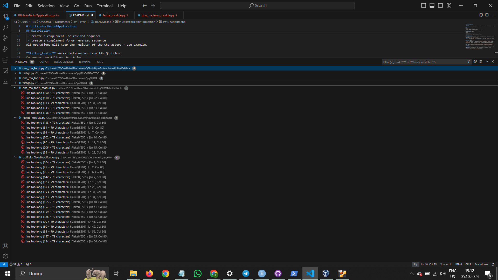
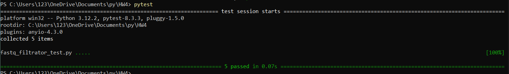

# UtilitsForBioinfApplication 

## Discription
Utilits for bioinformatical application is a script that consists of two main functions, run_dna_rna_tools and filter_fastqc.

**run_dna_rna_tools** works with DNA or RNA sequences. 
It can:
 - transcribe
 - reverse
 - create a complement for rovided sequence
 - create a complement foror reversed sequence
All operations will keep the register of the characters - see example.

**filter_fastqc** works dictionaries from FASTQC-files.
Sequences are filtered by their:
 - GC-content
 - length
 - quality of reads

Both functions use modules from helpertools folder to perform.

## Input and output format

For **run_dna_rna_tools**:
**Input:** list of any number of strings - DNA or RNA sequences. The last string should specify the operation to be applied to provided sequences - `transcribe'`, `reverse`, `complement` or `reverse complement`.
*Input example:* `['AtGC', 'aGGGT', 'transcribe']`

**Output:** changed sequences as a list, if only one sequence was given, it will return as a string. Operation will not be returned.
*Output example:* `['AuGC', 'aGGGU']` 

For **filter_fastqc**:
**Input:** four arguments:
`seqs` - a dictionary of FASTQC-sequences in format `{name of the sequence: (sequence, quality)}`, name is a string, sequence and its quality are strings in a tuple;
`gc_bounds` - a tuple of lower and upper bounds for gc-content in provided sequences or an int - only upper bound. If not specified is `(0, 100)` by default;
`length_bounds` - a tuple of lower and upper bounds for length of provided sequences or an int - only upper bound. If not specified is `(0, 2**32)` by default;
`quality_threshold` - an int - an upper bound for quality of reads for provided sequences. If not specified is `0` by default;
*Input example:* `{"@SRX079812": ("AGTGAGACACCCCTGAACATTCCTAGTAAG", "<98;<@@@:@CD@BCCDD=DBBCEBBAAA@")}, gc_bounds=(0, 100), length_bounds=(0, 35)`

**Output:** dictionary of sequences that passed by GC-content, length and read quality in format `{name of the sequence: (sequence, quality)}`. If no reads passed, `None` will be returned.
*Output example:* `{"@SRX079812": ("AGTGAGACACCCCTGAACATTCCTAGTAAG", "<98;<@@@:@CD@BCCDD=DBBCEBBAAA@")}`

## Limitations
**run_dna_rna_tools** can only work with one typa of NA at a time, you can not provide both in one run. It will also not accept mixed sequences with both 'U' and 'T' present and will not accept sequences if operation is not specified.

## Developmend
By Polina Kalitina (iduvzavtra@gmail.com), evenly spread on the floor by these seemingly easy tasks.

